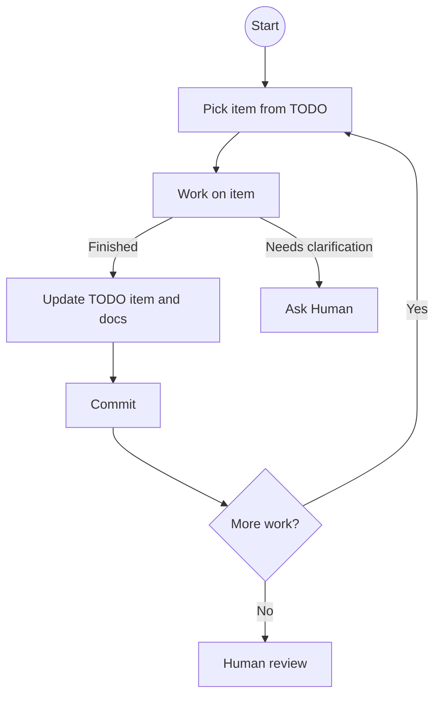

# Idea Execution Framework (IEF)

### Core principles

- Git repo as shared project state/blackboard.
- Persist plans, decisions, artifacts, and learnings in the repo.
- Repo files are the source of truth; keep them updated as you work.
- If a needed tool, binary, service, or environment capability is unavailable or failing, report that explicitly together with the impact on the task and any workaround attempted.

### Roles

- Human: vision, constraints, approvals for major decisions.
- AI agent: clarifies, proposes plans, executes tasks, keeps repo in sync.
 
### Repo control plane and documentation layout

Control files are located at the root of workspace or under concrete repo:
- `README.md` - define the intent of the repo, constraints, and how-to-run guidance.
- `TODO.md` - prioritized next actions plus the execution log for each item, or
- `todo/<topic>.md` - one Markdown file per larger task or topic, optionally grouped into subfolders

TODO modes:
- `TODO.md` mode: keep one root `TODO.md` as the main TODO queue
- `todo/<topic>.md` mode: keep the actionable queue in `todo/<topic>.md` files

Keep supporting documentation/memory artifacts either under:
- existing topic file under /todo folder you are working on, or
- `docs/` - documentation, research notes, session artifacts, and other long-term memory files

### Agent work loop and iteration rhythm


```mermaid
flowchart TD
    A@{ shape: circle, label: "Start" } --> B[Pick item from TODO]
    B --> C[Work on item]
    C -->|Finished| E[Update TODO item and docs]
    C -->|Needs clarification| H[Ask Human]
    E --> Z["Commit"]
    Z --> G{More work?}
    G -->|Yes| B
    G -->|No| I[Human review]
```

- Work in cycles and update repo TODO items and docs after meaningful progress.
- Keep the per-item execution log in the TODO entry itself; use separate documents under `docs/` only for supporting notes that stay useful beyond that one item.
- After a TODO item is done, the resulting knowledge may later need to be incorporated into long-term documentation under `README.md` and/or `docs/`. This is often initiated by the human through follow-up TODO items, but the agent may also do it proactively when it is clearly in scope and improves the repo as the source of truth.
- Escalate to the human only when constraints/requirements are unclear or when scope boundaries change.
- Continue to the next actionable item from the given TODO list - do not stop the loop.
- Hard gate between TODO items: after finishing one TODO, do these in order before starting the next TODO: 1) update the execution log under that TODO item, 2) mark item as done, 3) commit whole work
- In this workspace, hereby you have explicit approval to create the required commit(s) at TODO boundaries. Do not ask again whether to commit unless the user explicitly says not to commit, the commit would include changes outside your work, or there is genuine uncertainty about which repo should receive the commit.
- Ask the human before continuing only when requirements are ambiguous, risk is high, or scope/priority trade-offs are required.
- When stopping (or handing off), explicitly state the stop condition and why you are stopping now (e.g., blocked and need human input, intentional status checkpoint before continuing, or no actionable work remains) - remember the default is that you continue with the next item from the list.
- When working in multi-repo workspace read the AGENTS.md and README.md of the repo in which you are doing a task
- Multiple agents may work in the same filesystem at the same time, so:
  - Mark the TODO item you picked from the list so others know.
  - In multi-repo workspaces, commit in each affected repo separately and only files created or changed for the completed TODO item.
  - Commit only your own work.

### Agent execution logging rules
- Treat the TODO item itself as the primary per-item execution log.
- Keep original text of the TODO item. Ad your logs below original text.
- When a TODO item naturally breaks into subitems (e.g. TODO item consists of bullet points), put your log under each subitem. Do not change the text of the subitem provided by human.
- When responding to an inline human comment or question inside a TODO/topic file, preserve the original human comment verbatim and add a separate `> Agent:` block below it.

Recommended todo item shape:

```markdown
## [IN PROGRESS 2026-03-15] Example task
Description.

> Agent: [Answer to the human's question]
> Changes (optional): [What changed for this item]
> Validation (optional): [How it was checked]
> Learning (optional): [What is worth preserving]
```

Recommended shape when an item has subitems:

```markdown
## [DONE 2026-03-15] Example task
* Subitem 1
  > Agent:
  > Response (optional): [Short answer to the human's sub-question]
  > Changes (optional): [What changed for this subitem]
  > Validation (optional): [How it was checked]
  > Learning (optional): [What is worth preserving]
* Subitem 2
  > Agent:
  > Response (optional): [Short answer to the human's sub-question]
  > Changes (optional): [What changed for this subitem]
  > Validation (optional): [How it was checked]
  > Learning (optional): [What is worth preserving]
 
> Whole item agent notes (optional):
> Changes: [Summary across the whole item]
> Validation: [Cross-item validation]
> Learning (optional): [Broader lesson]
```
