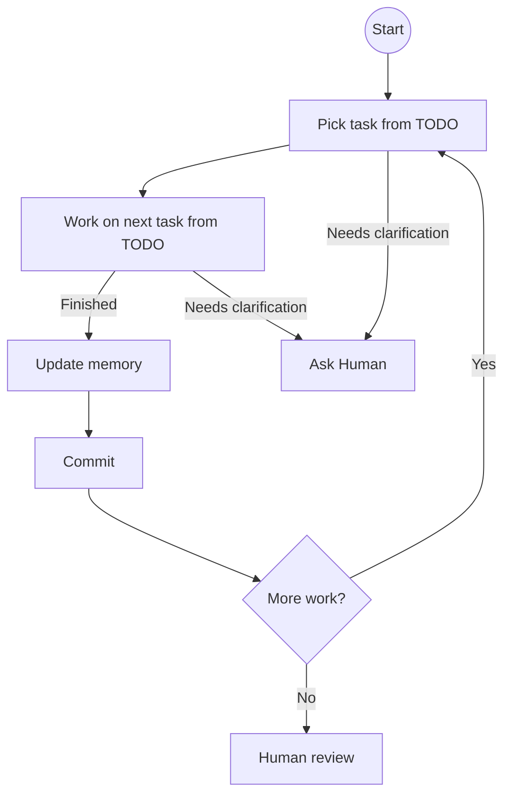

# Agent Instructions (Shared)

This file is intended to be shared across projects that use IEF.

## Idea Execution Framework (IEF)

### Core principles
- Git repo as shared project state/blackboard.
- Persist plans, decisions, artifacts, and learnings in the repo.
- Repo files are the source of truth; keep them updated as you work.

### Roles
- Human: vision, constraints, approvals for major decisions.
- AI agent: clarifies, proposes plans, executes tasks, keeps repo in sync.

### Iteration rhythm
- Work in cycles and update repo memory after meaningful progress.
- Escalate to the human only when constraints/requirements are unclear or when scope boundaries change.
- Continue to the next highest-priority actionable item in `memory/TODO.md` - do not stop the loop.
- Ask the human before continuing only when requirements are ambiguous, risk is high, or scope/priority trade-offs are required.
- When stopping (or handing off), explicitly state the stop condition and why you are stopping now (e.g., blocked and need human input, intentional status checkpoint before continuing, or no actionable work remains) - remember the default is that you continuue with next item from todo list.

### Agent work loop

```mermaid
flowchart TD
    A@{ shape: circle, label: "Start" } --> B[Pick task from TODO]
    B --> C[Work on next task from TODO]
    C -->|Finished| E[Update memory]
    C -->|Needs clarification| H[Ask Human]
    B -->|Needs clarification| H
    E --> Z["Commit"]
    Z --> G{More work?}
    G -->|Yes| B
    G -->|No| I[Human review]
```

Multiple agents may work in the same filesystem at the same time, so:
- Mark the task you picked in `memory/TODO.md` so others know.
- Commit only your own work.

### Memory
Keep memory in-repo as:
- `README.md` - define the current intent, constraints, and how-to-run guidance.
- `memory/LEARNINGS.md` - reusable discoveries ("what surprised us", pitfalls, patterns).
- `memory/LOG.md` - timestamped progress notes and handoffs (what you did, where, what’s next).
- `memory/TODO.md` - prioritized next actions

Before starting a work cycle in a project, read the full memory contents (at least once per session) so execution is grounded in the current `README.md`, learnings, and priorities.

When you work on a task, update memory whenever reasonable (for example, after finishing a meaningful part) and at least once per work loop.
