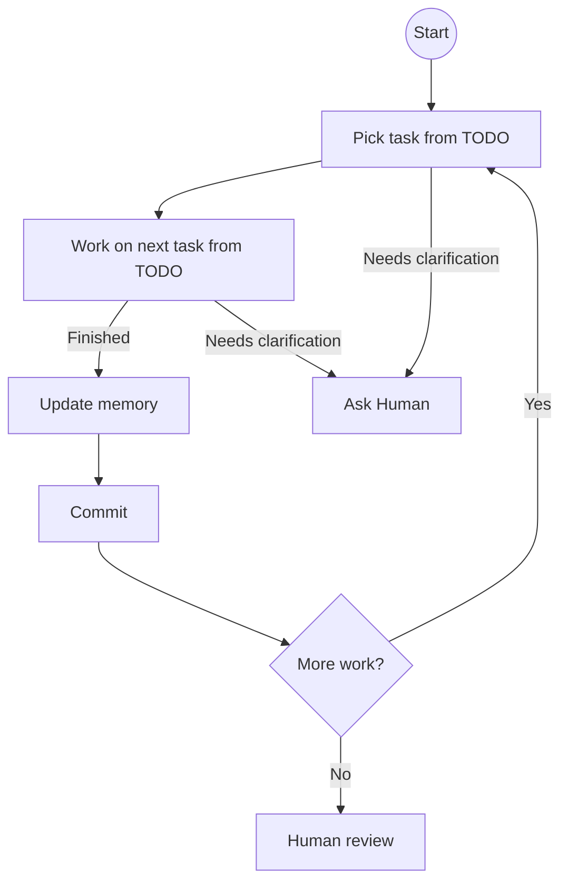

# Agent Instructions (Shared)

This file is intended to be shared across projects that use IEF.

## Idea Execution Framework (IEF)

### Core principles
- Git repo as shared project state/blackboard.
- Persist plans, decisions, artifacts, and learnings in the repo.
- Repo files are the source of truth; keep them updated as you work.
- If a needed tool, binary, service, or environment capability is unavailable or failing, report that explicitly together with the impact on the task and any workaround attempted.

### Roles
- Human: vision, constraints, approvals for major decisions.
- AI agent: clarifies, proposes plans, executes tasks, keeps repo in sync.

### Iteration rhythm
- Work in cycles and update repo memory after meaningful progress.
- Escalate to the human only when constraints/requirements are unclear or when scope boundaries change.
- Continue to the next highest-priority actionable item in `TODO.md` - do not stop the loop.
- Hard gate between TODO items: after finishing one TODO, do these in order before starting the next TODO: 1) update the execution log under that TODO item or its dedicated task file, 2) mark it done in `TODO.md`, 3) commit immediately
- Ask the human before continuing only when requirements are ambiguous, risk is high, or scope/priority trade-offs are required.
- When stopping (or handing off), explicitly state the stop condition and why you are stopping now (e.g., blocked and need human input, intentional status checkpoint before continuing, or no actionable work remains) - remember the default is that you continuue with next item from todo list.

### Agent work loop


```mermaid
flowchart TD
    A@{ shape: circle, label: "Start" } --> B[Pick task from TODO]
    B --> C[Work on next task from TODO]
    C -->|Finished| E[Update memory]
    C -->|Needs clarification| H[Ask Human]
    B -->|Needs clarification| H
    E --> Z["Commit"]
    Z --> G{More work?}
    G -->|Yes| B
    G -->|No| I[Human review]
```

Multiple agents may work in the same filesystem at the same time, so:
- Mark the task you picked in `TODO.md` so others know.
- Keep commit granularity aligned to TODO completion (one commit per completed TODO whenever feasible).
- Commit only your own work.

### Repo control plane and memory layout

Keep repo control files at the root as:
- `README.md` - define the current intent, constraints, and how-to-run guidance.
- `TODO.md` - prioritized next actions plus the execution log for each item, either inline or by linking to a dedicated task file

Keep supporting memory artifacts under:
- `memory/` - plans, research notes, session artifacts, and other extended memory files

Optional extended task tracking is also allowed under:
- `todo/` - one markdown file per larger task or topic, optionally grouped into subfolders such as `doing-now/`, `doing-today/`, or parked buckets

Optional legacy archive:
- `LOG.md` - historical archive for repos that previously used a separate chronological log

Rules:
- `TODO.md` remains the top-level queue/dashboard even when `todo/` exists
- each task keeps its own execution log either directly under the item in `TODO.md` or in its linked file under `todo/`
- `todo/` is for larger task-local notes, acceptance criteria, or embedded logs when the work benefits from more structure
- `LOG.md` is optional and should only be used as a legacy archive or migration aid, not as the default place for new execution notes

Recommended `TODO.md` item shape:

```markdown
## [IN PROGRESS 2026-03-15] Example task
Short task description or a pointer to `todo/.../*.md`.

### Log
- 2026-03-15 - Started the task.
- 2026-03-15 - Outcome: [What changed]. Learning: [What was discovered].
```

Before starting a work cycle in a project, read the full memory contents (at least once per session) so execution is grounded in the current `README.md`, `TODO.md`, any linked task files under `todo/`, and relevant supporting artifacts under `memory/`.

When you work on a task, update its TODO-local execution log whenever reasonable (for example, after finishing a meaningful part) and at least once per work loop.
