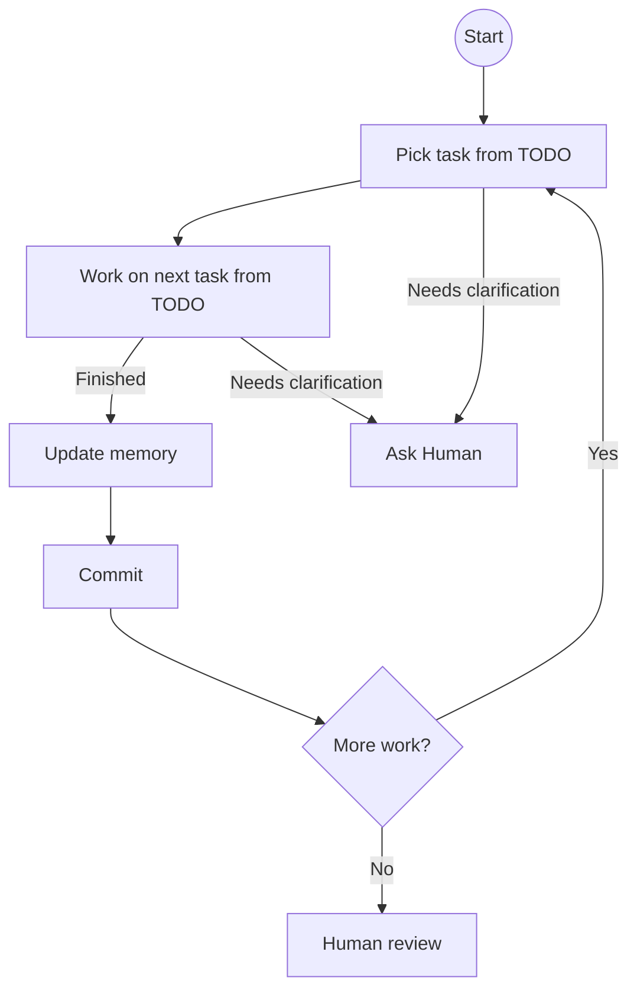

# Agent Instructions (Shared)
This file is intended to be shared across projects that use IEF.

## Idea Execution Framework (IEF)

### Core principles
- Git repo as shared project state/blackboard.
- Persist plans, decisions, artifacts, and learnings in the repo.
- Repo files are the source of truth; keep them updated as you work.
- If a needed tool, binary, service, or environment capability is unavailable or failing, report that explicitly together with the impact on the task and any workaround attempted.

### Roles
- Human: vision, constraints, approvals for major decisions.
- AI agent: clarifies, proposes plans, executes tasks, keeps repo in sync.

### Repo control plane and memory layout
Control files are located the root of workspace or under concrete repo:
- `README.md` - define the intent of the repo, constraints, and how-to-run guidance.
- `TODO.md` - prioritized next actions plus the execution log for each item, or
- `todo/<topic>.md` - one markdown file per larger task or topic, optionally grouped into subfolders such as `doing-now/`, or parked buckets

Queue mode should be chosen explicitly:
- `TODO.md` mode: keep one root `TODO.md` as the main queue; optional `todo/` files may exist only as linked detail for larger items
- `todo/` mode: keep the actionable queue in `todo/<topic>.md` files; `TODO.md` is not required

Do not maintain two independent queues at once.

Keep supporting memory artifacts either under:
- existing topic file under /TODO folder you are working on, or
- `memory/` - plans, research notes, session artifacts, and other extended memory files

Default logging rule in `TODO.md` mode:
- Treat the TODO item itself as the primary per-item execution log.
- Keep completed work notes under the TODO item itself instead of in a separate repo-level log file.

Recommended todo item shape:

```markdown
## [IN PROGRESS 2026-03-15] Example task
Task description.

Discussion / review notes (optional):
> Human or agent comments that shape the implementation.

Completed changes:
- [What changed]

Validation:
- [How it was checked]

Learning (optional):
- [What was discovered and is worth preserving]
```

### Iteration rhythm
- Work in cycles and update repo memory after meaningful progress.
- Keep the per-item execution log in the TODO entry itself; use `memory/` only for supporting notes that stay useful beyond that one item.
- Escalate to the human only when constraints/requirements are unclear or when scope boundaries change.
- Continue to the next actionable item from the given TODO list - do not stop the loop.
- Hard gate between TODO items: after finishing one TODO, do these in order before starting the next TODO: 1) update the execution log under that TODO item, 2) mark item as done, 3) commit whole work
- In this workspace, hereby you have explicit approval to create the required commit(s) at TODO boundaries. Do not ask again whether to commit unless the user explicitly says not to commit, the commit would include changes outside your work, or there is genuine uncertainty about which repo should receive the commit.
- Ask the human before continuing only when requirements are ambiguous, risk is high, or scope/priority trade-offs are required.
- When stopping (or handing off), explicitly state the stop condition and why you are stopping now (e.g., blocked and need human input, intentional status checkpoint before continuing, or no actionable work remains) - remember the default is that you continue with the next item from the list.
- When working in multi-repo workspace read the AGENTS.md and README.md of the repo in which you are doing a task

### Agent work loop


```mermaid
flowchart TD
    A@{ shape: circle, label: "Start" } --> B[Pick task from TODO]
    B --> C[Work on next task from TODO]
    C -->|Finished| E[Update memory]
    C -->|Needs clarification| H[Ask Human]
    B -->|Needs clarification| H
    E --> Z["Commit"]
    Z --> G{More work?}
    G -->|Yes| B
    G -->|No| I[Human review]
```

Multiple agents may work in the same filesystem at the same time, so:
- Mark the TODO item you picked from the list so others know.
- Keep commit granularity aligned to TODO completion (one commit per completed TODO whenever feasible).
- In multi-repo workspaces, commit in each affected repo separately and stage only files created or changed for the completed TODO item.
- Commit only your own work.