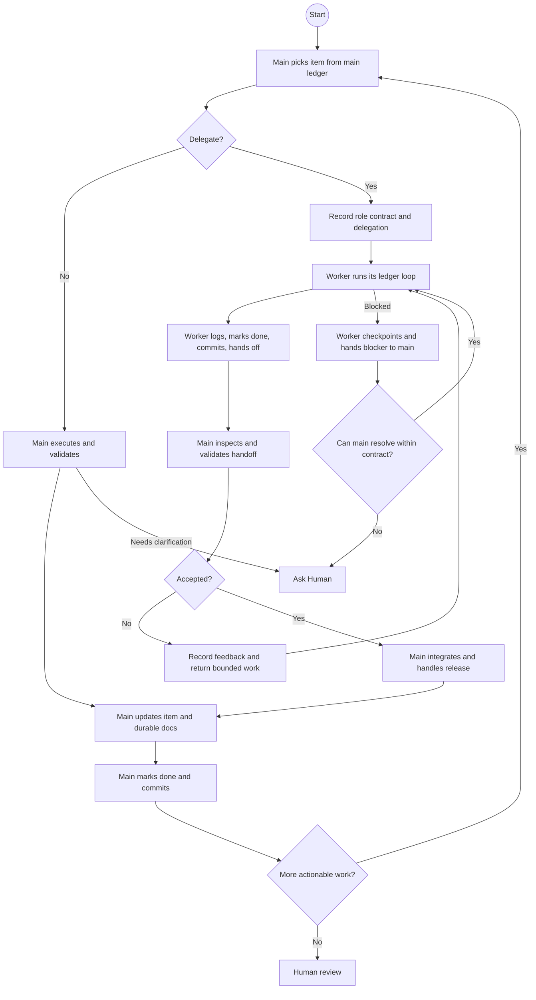

# Idea Execution Framework (IEF)

## Core principles

- Git repo as shared project state/blackboard.
- Persist plans, decisions, artifacts, and learnings in the repo.
- Repo files are the source of truth; keep them updated as you work.
- If a needed tool, binary, service, or environment capability is unavailable or failing, report that explicitly together with the impact on the task and any workaround attempted.

## Roles

- Human: vision, constraints, approvals for major decisions.
- Main AI agent: owns the big picture, decomposition, shared interfaces, ledger state, acceptance, integration, and human communication.
- Persistent role: a repository-defined specialization with a stable `role_id`, charter, ownership, ledger, history, and return condition. It is durable project memory, not a running model.
- Worker session: one temporary model/runtime execution acting for a persistent role or a one-off workstream. It owns its bounded files, validation, execution log, and handoff for that run.
- Workstream: the concrete bounded outcome assigned to `main` or a worker session. A role may execute many workstreams over time; a one-off workstream does not require a new persistent role.

Worker sessions and persistent specialist roles are optional. Start with the main agent alone. Introduce a role when the project repeatedly produces a distinct, context-heavy type of work that benefits from accumulated domain knowledge and a stable ownership boundary.

The main agent may execute work directly. Delegation is a tool, not a goal: prefer it when work benefits from specialized context. Keep small tasks, shared-interface changes, integration, and high-conflict hotspots with the main agent unless isolation removes the conflict.

## Multi-agent coordination

### Persistent roles and disposable sessions

A durable worker identity is a repository role. Define a stable `role_id`, remit, owned paths, standing constraints, ledger, accepted commits, useful learnings, and last handoff. Model context belongs to a session; durable role context belongs to the repository.

Keep a role roster in the main ledger or a linked `agent-roles.md`. On startup, a returning worker reads the repo instructions, role charter, current ledger, relevant long-term docs, and last handoff. Do not depend on raw chat history.

If the orchestrator still exposes an existing session for the role, prefer reusing it when the context is relevant, uncontended, and still reliable. Start a fresh session with a controlled fork of current `main` context when the old handle is unavailable, stale or noisy, currently busy with conflicting work, or when the new work depends more on recent cross-project decisions than on the role's previous thread. Do not assume a native subagent handle survives a client restart. If continuity across processes is required and the backend supports an explicit persisted session identifier, resume that session deliberately; in every case, reconstruct and verify state from the role ledger before acting.

Prefer a small stable set of domain roles over creating a new persona for every task. Add a persistent role only when repeated work benefits from accumulated domain context and a reasonably stable ownership boundary.

The main agent may create, merge, or archive a role without separate human approval. Before starting its first session, main records the role charter, ledger, ownership, standing constraints, and return condition on the canonical control surface. Ask the human first if the role would expand project scope, priorities, external authority, deployment permissions, cost, or another material constraint.

Close each session cleanly:

1. finish or checkpoint the current bounded item;
2. update the ledger with decisions, validation, limitations, and the next concrete action;
3. commit owned work when the item is complete;
4. return a concise handoff to the main agent;
5. record downstream acceptance or useful user feedback in the role history when it improves future work.

Use bounded sessions and hand off after meaningful milestones, before context quality degrades. Move passive polling, build waiting, and recurring monitoring to automation or a monitoring mechanism so a specialist is not occupied by idle waiting.

### Worker control plane

For each delegated workstream:

1. Create or reuse a dedicated ledger. Prefer `todo-<role_id>.md` for a recurring persistent role and `todo-<topic>.md` or `todo/<topic>.md` for a one-off workstream.
2. Register its owner, status, scope, and return condition in the main ledger or in the canonical role roster linked from it.
3. Before starting the worker, record the outcome, acceptance criteria, owned and forbidden scope, authority to commit or deploy, and required acceptance evidence. Leave implementation choices and exact validation commands to the worker unless the repository defines a mandatory gate or a specific risk requires one.
4. The worker marks its item, logs meaningful progress in its ledger, commits only its work, and returns the commit plus validation, decisions, limitations, and follow-ups.
5. The main agent independently inspects the handoff, resolves integration issues, updates the main ledger, and owns final cross-workstream tests and release actions.

Commit the delegation contract and workstream registration before launching the worker so every participant sees the same durable assignment.

The normal worker instruction is outcome-oriented and explicit about the control plane, for example:

```text
Execute the IEF loop on <ledger> within the delegation contract recorded there.
Continue through all actionable items, committing at item boundaries, then hand off.
```

This means the worker runs the same pick → execute → log → mark done → commit → continue loop against its dedicated ledger. It does not mean the worker may change the main ledger, integrate other workstreams, deploy, or broaden its scope unless the delegation contract grants that authority. The main agent, not the worker, closes the corresponding main-ledger item after acceptance.

The ledger and Git commits are the durable identity of the workstream. An agent/session identifier is optional execution metadata and must not be the only place where context or decisions exist.

Keep the role roster and current workstream registration on one canonical surface, such as `agent-roles.md` next to the ledgers.

### Worker backend

Use a native subagent when the current orchestrator exposes structured spawn, steering, wait, and handoff operations. It is the default reference implementation today, especially for interactive work and reuse of an available role thread.

Use a separate CLI process, CI job, service, worktree, or other backend when the worker must outlive the current orchestrator, run through automation, or have stronger execution isolation. Backend capabilities determine whether model context itself can be resumed. IEF requires only that the role, contract, progress, evidence, and handoff remain reconstructable from the repository.

## Repo control plane and documentation layout

Every concrete repository keeps a `README.md` at its root to define intent, constraints, and how-to-run guidance. Keep the actionable queue on one or more clearly linked Markdown control surfaces:

- `TODO.md` for a single queue;
- `todo-main.md` plus `todo-<role_id>.md` for a main queue and recurring roles;
- `todo/<topic>.md` or another consistently named topic file for larger one-off workstreams.

The exact naming convention is a repository decision, not a framework mode. Document it in the repository README and link all secondary ledgers from one canonical main ledger or role roster.

Recommended todo item status vocabulary:

- `NEW` — not started;
- `IN PROGRESS <loop>` — currently owned and being executed;
- `DELEGATED <loop>` — main-ledger item assigned through a recorded worker contract;
- `BLOCKED <loop>` — cannot progress without a named external change or human decision;
- `DONE <loop>` — result logged, validated, and committed.

Keep supporting documentation/memory artifacts either under:

- existing topic file you are working on, or
- `docs/` - documentation, research notes, session artifacts, and other long-term memory files

## Agent work loop and iteration rhythm


```mermaid
flowchart TD
    A@{ shape: circle, label: "Start" } --> B[Main picks item from main ledger]
    B --> C{Delegate?}
    C -->|No| D[Main executes and validates]
    C -->|Yes| E[Record role contract and delegation]
    E --> F[Worker runs its ledger loop]
    F --> G[Worker logs, marks done, commits, hands off]
    G --> H[Main inspects and validates handoff]
    H --> O{Accepted?}
    O -->|No| P[Record feedback and return bounded work]
    P --> F
    O -->|Yes| Q[Main integrates and handles release]
    D --> I[Main updates item and durable docs]
    Q --> I
    D -->|Needs clarification| J[Ask Human]
    F -->|Blocked| N[Worker checkpoints and hands blocker to main]
    N --> R{Can main resolve within contract?}
    R -->|Yes| F
    R -->|No| J
    I --> K[Main marks done and commits]
    K --> L{More actionable work?}
    L -->|Yes| B
    L -->|No| M[Human review]
```

- Work in cycles and update repo TODO items and docs after meaningful progress.
- Keep the per-item execution log in the TODO entry itself; use separate documents under `docs/` only for supporting notes that stay useful beyond that one item.
- After a TODO item is done, the resulting knowledge may later need to be incorporated into long-term documentation under `README.md` and/or `docs/`. This is often initiated by the human through follow-up TODO items, but the agent may also do it proactively when it is clearly in scope and improves the repo as the source of truth.
- `main` escalates to the human only when constraints or requirements are unclear, risk is high, or scope/priority boundaries change. A worker normally returns such a blocker to `main` unless its contract explicitly grants direct coordination.
- Continue to the next actionable item from the given TODO list - do not stop the loop.
- Hard gate between TODO items: after finishing one TODO, do these in order before starting the next TODO: 1) update the execution log under that TODO item, 2) mark the item as done, 3) commit only the files belonging to that completed item.
- In this workspace, hereby you have explicit approval to create the required commit(s) at TODO boundaries. Do not ask again whether to commit unless the user explicitly says not to commit, the commit would include changes outside your work, or there is genuine uncertainty about which repo should receive the commit.
- When stopping (or handing off), explicitly state the stop condition and why you are stopping now (e.g., blocked and need human input, intentional status checkpoint before continuing, or no actionable work remains) - remember the default is that you continue with the next item from the list.
- When working in a multi-repo workspace, read the `AGENTS.md` and `README.md` of the repository in which you are doing a task.
- Treat the active TODO file as the authoritative loop ledger, not the chat transcript. Before the final response for a loop, rescan the TODO/topic file and derive the list of items completed in the current loop from that file.
- If the repo defines a loop label scheme, reuse it across all items completed in the same loop and use that label when producing the final loop summary. If the repo does not define loop label scheme that is unique per loop execution use a date plus ordinal label such as `2026-04-09.1`.

### Concurrent work safety

- Assume another agent or the human may edit the same checkout. Mark an item when you pick it and inspect Git state again before editing and committing.
- Preserve unrelated changes. Never include another participant's files in your commit merely to obtain a clean worktree.
- Give write-heavy parallel workers separate worktrees when practical. Otherwise assign uncontended owned paths or serialize work touching shared interfaces and ledgers.
- The owner of a shared contract coordinates its changes; workers do not independently redefine it during implementation.

### Backlog discovery

- When execution reveals worthwhile, actionable work that is absent from the ledgers, add a concise `NEW` item to the appropriate queue instead of relying on chat memory.
- Record the observation, expected outcome, and why it matters sufficiently for later triage. Link evidence or the originating item when useful.
- Do not broaden the current item's scope merely because a related improvement was discovered. Finish the current contract first unless the discovery is required for acceptance or is an urgent safety/security issue.
- Avoid duplicate, speculative, or low-value TODO noise. Human-defined priorities remain authoritative; newly discovered work enters the queue for normal prioritization rather than jumping ahead automatically.
- A worker adds discoveries only to its owned ledger unless its contract authorizes another surface. `main` accepts, moves, merges, or rejects them during handoff.

## Repo loop extensions

- A concrete repo may extend this base loop in its own `AGENTS.md` or `ief-loop-extensions.md` file (e.g. repo-specific recurring tasks, stop conditions or reporting requirements).
- Search for, read and follow rules in `ief-loop-extensions.md`.

## Agent execution logging rules
- Treat the TODO item itself as the primary per-item execution log.
- Keep original text of the TODO item. Add your logs below the original text.
- When a TODO item naturally breaks into subitems (e.g. TODO item consists of bullet points), put your log under each subitem. Do not change the text of the subitem provided by human.
- When responding to an inline human comment or question inside a TODO/topic file, preserve the original human comment verbatim and add a separate `> Agent:` block below it.
- Within one continuous block from the same speaker, prefix only the first line with `> Agent:` or `>> Human:` and keep the following lines in the same quote level until the speaker changes.
- Longer inline discussions are allowed when they stay useful for the item. Preserve the existing quote nesting and continue it explicitly, for example `> Agent:`, `>> Human:`, `>>> Agent:`.

Recommended todo item shape:

```markdown
## [IN PROGRESS 2026-03-15.1] Example task
Description.

> Agent: [Answer to the human's question] (optional)
> Changes (optional): [What changed for this item]
> Validation (optional): [How it was checked]
> Learning (optional): [What is worth preserving]
```

Recommended shape for longer inline discussion:

```markdown
> Agent: [Initial answer]
> Continuation of the same agent block.
>> Human: [Follow-up, correction, or question]
>> Continuation of the same human block.
>>> Agent: [Refined answer after the follow-up]
>>> Continuation of the refined agent block.
```

Recommended shape when an item has subitems:

```markdown
## [DONE 2026-03-15.1] Example task
* Subitem 1
  > Agent: [Answer to the human's question] (optional)
  > Changes (optional): [What changed for this subitem]
  > Validation (optional): [How it was checked]
  > Learning (optional): [What is worth preserving]
* Subitem 2
  > Agent: [Answer to the human's question] (optional)
  > Changes (optional): [What changed for this subitem]
  > Validation (optional): [How it was checked]
  > Learning (optional): [What is worth preserving]
 
> Whole item agent notes (optional):
> Changes: [Summary across the whole item]
> Validation: [Cross-item validation]
> Learning (optional): [Broader lesson]
```
