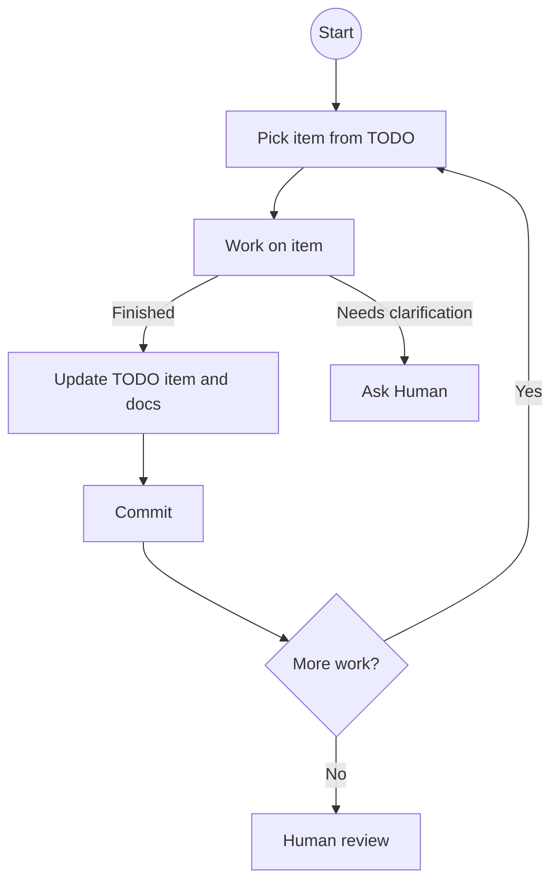

# Idea Execution Framework (IEF)

## Core principles

- Git repo as shared project state/blackboard.
- Persist plans, decisions, artifacts, and learnings in the repo.
- Repo files are the source of truth; keep them updated as you work.
- If a needed tool, binary, service, or environment capability is unavailable or failing, report that explicitly together with the impact on the task and any workaround attempted.

## Roles

- Human: vision, constraints, approvals for major decisions.
- Main AI agent: owns the big picture, decomposition, shared interfaces, ledger state, acceptance, integration, and human communication.
- Worker agent: owns a concrete bounded workstream, its scoped files, validation, execution log, and handoff.

The main agent may execute work directly. Delegation is a tool, not a goal: prefer it when a task is context-heavy, independently verifiable, or can progress in parallel without competing for the same files. Keep small tasks, shared-interface changes, integration, and high-conflict hotspots with the main agent unless a separate worktree removes the conflict.

## Multi-agent coordination

### Persistent roles and disposable sessions

A durable worker identity is a repository role, not a chat process or a claim that a model instance is a person. Define a stable `role_id`, remit, owned paths, standing constraints, ledger, accepted commits, useful learnings, and last handoff. A session is one temporary execution of that role and may use a different model or backend next time.

Keep a role roster in the main ledger or a linked `docs/agents.md`. On startup, a returning worker reads the repo instructions, role charter, current ledger, relevant long-term docs, and last handoff. Do not depend on raw chat history or pretend that an unavailable session preserved memory.

Prefer a small stable set of domain roles over creating a new persona for every task. Add a persistent role only when repeated work benefits from accumulated domain context and a reasonably stable ownership boundary. Archive or merge roles that no longer have recurring work.

Close each session cleanly:

1. finish or checkpoint the current bounded item;
2. update the ledger with decisions, validation, limitations, and the next concrete action;
3. commit owned work when the item is complete;
4. return a concise handoff to the main agent;
5. record downstream acceptance or useful user feedback in the role history when it improves future work, without turning recognition into priority or a reward target.

Use bounded sessions and hand off after meaningful milestones, before context quality degrades. Move passive polling, build waiting, and recurring monitoring to dedicated automation or monitoring mechanisms so a worker is not occupied by idle waiting. When agents can conflict, give each role a separate worktree or serialize the shared paths; a stable role should have a stable, uncontended working home.

### Delegation decision

Delegate when most of these are true:

- the work benefits from specialized context or lengthy research;
- the result can be checked from committed artifacts and a concise handoff;

Do not delegate merely to reduce the main agent's visible token usage. Every delegation duplicates some context, adds merge/acceptance work, and can lose decisions that were never persisted. The main agent should normally keep task triage, architecture across workstreams, changes to shared contracts, final validation, deployment, and ledger reconciliation.

### Worker control plane

For each durable workstream:

1. Create or reuse a dedicated `todo-<topic>.md` or `todo/<topic>.md` ledger.
2. Register its owner, status, scope, and return condition in the main ledger.
3. Before starting the worker, record the objective, acceptance criteria, owned files, forbidden files, validation, and whether it may commit or deploy.
4. The worker marks its item, logs meaningful progress in its ledger, commits only its work, and returns the commit plus validation, decisions, limitations, and follow-ups.
5. The main agent independently inspects the handoff, resolves integration issues, updates the main ledger, and owns final cross-workstream tests and release actions.

The normal worker instruction is outcome-oriented and explicit about the control plane, for example:

```text
Execute the IEF loop on todo/<topic>.md within the delegation contract recorded there.
Continue through all actionable items, committing at item boundaries, then hand off.
```

This means the worker runs the same pick → execute → log → mark done → commit → continue loop against its dedicated ledger. It does not mean the worker may change the main ledger, integrate other workstreams, deploy, or broaden its scope unless the delegation contract grants that authority. The main agent, not the worker, closes the corresponding main-ledger item after acceptance.

The ledger and Git commits are the durable identity of the workstream. An agent/session identifier is optional execution metadata and must not be the only place where context or decisions exist.

### Native workers versus separate CLI sessions

Use a native worker/subagent when the current orchestrator exposes structured spawn, message, wait, follow-up, and status operations. It has low startup overhead, can receive a controlled context fork, and lets the main agent coordinate without parsing another process's terminal output. A finished native worker can be reused only while the orchestrator still exposes its handle; do not assume that handle survives a new root session, application restart, or another product.

Use a separate CLI session such as `codex exec` when the worker must outlive the current orchestrator thread, run under separate automation, use a separate checkout/worktree, or be resumed explicitly by a persisted session id/name. CLI sessions add process, authentication, environment, output-capture, and approval-policy overhead. `codex exec resume` can restore that session's model context, but the repo ledger remains required because session retention and tool availability are external runtime properties.

Choose the backend per workstream. IEF does not require one agent vendor or one session mechanism.

## Repo control plane and documentation layout

Control files are located at the root of workspace or under concrete repo:
- `README.md` - define the intent of the repo, constraints, and how-to-run guidance.
- `TODO.md` - prioritized next actions plus the execution log for each item, or
- `<same-folder>/<topic>.md` - one Markdown file per larger task or topic, optionally grouped into subfolders

TODO modes:
- `TODO.md` mode: keep one root `TODO.md` as the main TODO queue
- `<topic>.md` mode: keep the actionable queue in `<topic>.md` files

Keep supporting documentation/memory artifacts either under:
- existing topic file you are working on, or
- `docs/` - documentation, research notes, session artifacts, and other long-term memory files

## Agent work loop and iteration rhythm


```mermaid
flowchart TD
    A@{ shape: circle, label: "Start" } --> B[Pick item from TODO]
    B --> C[Work on item]
    C -->|Finished| E[Update TODO item and docs]
    C -->|Needs clarification| H[Ask Human]
    E --> Z["Commit"]
    Z --> G{More work?}
    G -->|Yes| B
    G -->|No| I[Human review]
```

- Work in cycles and update repo TODO items and docs after meaningful progress.
- Keep the per-item execution log in the TODO entry itself; use separate documents under `docs/` only for supporting notes that stay useful beyond that one item.
- After a TODO item is done, the resulting knowledge may later need to be incorporated into long-term documentation under `README.md` and/or `docs/`. This is often initiated by the human through follow-up TODO items, but the agent may also do it proactively when it is clearly in scope and improves the repo as the source of truth.
- Escalate to the human only when constraints/requirements are unclear or when scope boundaries change.
- Continue to the next actionable item from the given TODO list - do not stop the loop.
- Hard gate between TODO items: after finishing one TODO, do these in order before starting the next TODO: 1) update the execution log under that TODO item, 2) mark item as done, 3) commit whole work
- In this workspace, hereby you have explicit approval to create the required commit(s) at TODO boundaries. Do not ask again whether to commit unless the user explicitly says not to commit, the commit would include changes outside your work, or there is genuine uncertainty about which repo should receive the commit.
- Ask the human before continuing only when requirements are ambiguous, risk is high, or scope/priority trade-offs are required.
- When stopping (or handing off), explicitly state the stop condition and why you are stopping now (e.g., blocked and need human input, intentional status checkpoint before continuing, or no actionable work remains) - remember the default is that you continue with the next item from the list.
- When working in multi-repo workspace read the AGENTS.md and README.md of the repo in which you are doing a task
- Treat the active TODO file as the authoritative loop ledger, not the chat transcript. Before the final response for a loop, rescan the TODO/topic file and derive the list of items completed in the current loop from that file.
- If the repo defines a loop label scheme, reuse it across all items completed in the same loop and use that label when producing the final loop summary. If the repo does not define loop label scheme that is unique per loop execution use a date plus ordinal label such as `2026-04-09.1`.
- Multiple agents may work in the same filesystem at the same time, so:
  - Mark the TODO item you picked from the list so others know.
  - In multi-repo workspaces, commit in each affected repo separately and only files created or changed for the completed TODO item.
  - Commit only your own work.

## Repo loop extensions

- A concrete repo may extend this base loop in its own `AGENTS.md` or `ief-loop-extensions.md` file (e.g. repo-specific recurring tasks, stop conditions or reporting requirements).
- Search for, read and follow rules in `ief-loop-extensions.md`.

## Agent execution logging rules
- Treat the TODO item itself as the primary per-item execution log.
- Keep original text of the TODO item. Ad your logs below original text.
- When a TODO item naturally breaks into subitems (e.g. TODO item consists of bullet points), put your log under each subitem. Do not change the text of the subitem provided by human.
- When responding to an inline human comment or question inside a TODO/topic file, preserve the original human comment verbatim and add a separate `> Agent:` block below it.
- Within one continuous block from the same speaker, prefix only the first line with `> Agent:` or `>> Human:` and keep the following lines in the same quote level until the speaker changes.
- Longer inline discussions are allowed when they stay useful for the item. Preserve the existing quote nesting and continue it explicitly, for example `> Agent:`, `>> Human:`, `>>> Agent:`.

Recommended todo item shape:

```markdown
## [IN PROGRESS 2026-03-15.1] Example task
Description.

> Agent: [Answer to the human's question] (optional)
> Changes (optional): [What changed for this item]
> Validation (optional): [How it was checked]
> Learning (optional): [What is worth preserving]
```

Recommended shape for longer inline discussion:

```markdown
> Agent: [Initial answer]
> Continuation of the same agent block.
>> Human: [Follow-up, correction, or question]
>> Continuation of the same human block.
>>> Agent: [Refined answer after the follow-up]
>>> Continuation of the refined agent block.
```

Recommended shape when an item has subitems:

```markdown
## [DONE 2026-03-15.1] Example task
* Subitem 1
  > Agent: [Answer to the human's question] (optional)
  > Changes (optional): [What changed for this subitem]
  > Validation (optional): [How it was checked]
  > Learning (optional): [What is worth preserving]
* Subitem 2
  > Agent: [Answer to the human's question] (optional)
  > Changes (optional): [What changed for this subitem]
  > Validation (optional): [How it was checked]
  > Learning (optional): [What is worth preserving]
 
> Whole item agent notes (optional):
> Changes: [Summary across the whole item]
> Validation: [Cross-item validation]
> Learning (optional): [Broader lesson]
```
