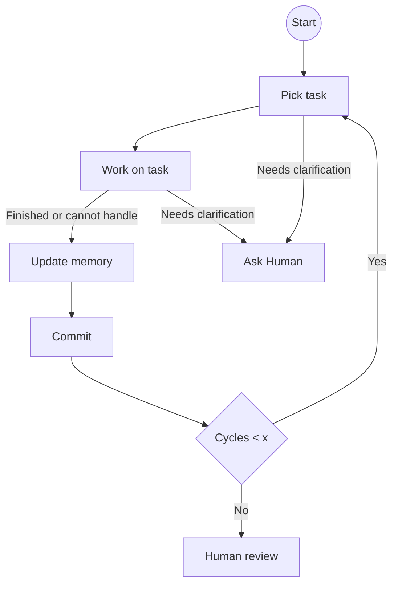

# Agent Instructions (Shared)

This file is intended to be shared across projects that use IEF.

## Idea Execution Framework (IEF)

### Core principles
- Git repo as shared project state/blackboard.
- Persist plans, decisions, artifacts, and learnings in the repo.
- Repo files are the source of truth; keep them updated as you work.

### Roles
- Human: vision, constraints, approvals for major decisions.
- AI agent: clarifies, proposes plans, executes tasks, keeps repo in sync.

### Iteration rhythm
- Work in cycles and update repo memory after meaningful progress.
- Escalate to the human only when constraints/requirements are unclear or when scope boundaries change.

### Agent work loop

There may be more other agents working on the same filesystem at the same time so: 
* mark the task you've picked so others know
* commit only your own work

### Memory
Keep memory in-repo as:
- `README.md`- define the current intent, constraints, and how-to-run guidance.
- `memory/DECISIONS.md`
- `memory/LEARNINGS.md`
- `memory/LOG.md`
- `memory/TODO.md`

Before starting a work cycle in a project, read the full memory contents (at least once per session) so execution is grounded in current README.md, decisions, learnings, and priorities.

Update memory when:
- a decision affects future work,
- a learning generalizes beyond the immediate change,
- a work cycle completes or changes direction.

