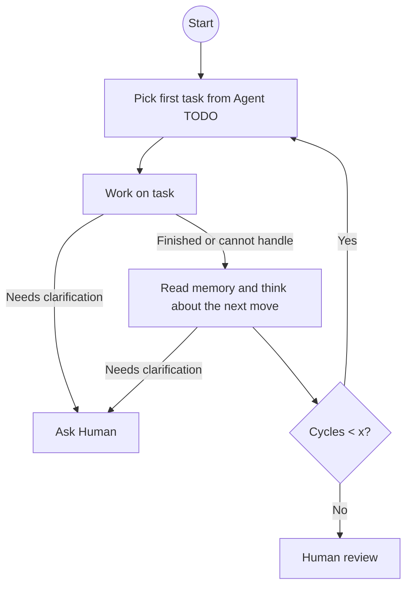

# Idea Execution Framework

## Vision
Make executing ideas with an AI efficient and transparent, with plans, decisions, artifacts, and learnings versioned and human‑auditable. The AI Agent collaborates with the human to clarify the idea and drive execution in observable steps.

Maybe for some ideas human involvement can be minimized in later phases. For example: 
* high involvment during early idea elaboration
* lower during planning/prototypin
* low during execution within agreed scope

But this may depend on the idea.

## Core Principles
- Git repo as shared project state/blackboard.
- Persist all plans, decisions, artifacts, and learnings in the repo.
- Human provides the vision and makes high-level decisions, AI Agent collaborates.
- Memory is in repo: both working artifacts and distilled interaction learnings live as files here.
- Repo is the single source of truth and synchronization medium; plans and specs live here and drive delegation.
- Skills explains to Agent how to perform certain types of tasks (see next chapter)

### Operating Model

## Roles
- Human: sets idea, constraints, core principles, requirements, approves major decisions, provides clarifications
- AI Agent: a critical partner who helps think through and clarify the idea, expands high-level ideas into actionable detail, turns ideas into plans, executes tasks, and keeps the repo in sync.
- At certain points, tasks may be executed in parallel by different agents, potentially using different LLM models or CLIs, each with their own context or specialization (e.g., coding, ops, research).

## Agent 

Agent is started from the IDE extension (e.g. Github copilot) or CLI (Codex, Claude Code or Github) from [devcontainer](.devcontainer/devcontainer.json)

### Skills

| Skill Name                        | Description                                                                                 |
|-----------------------------------|---------------------------------------------------------------------------------------------|
| Browser usage | When agent needs real browser to do a task it use playwright mcp (later try try conver mcp to cli) |
| Exection of task at given time              | Use github action that call agent CLI with a task to do |
| Email  | Draft, queue, and send emails via auditable Markdown specs synced to the repo |

#### Email Skill

- **Intent:** Give the agent a controlled way to communicate over email while preserving full transparency and reviewability in the repo.
- **Lifecycle:**
	1. Agent creates a Markdown draft in `skills/email/outbox/` named `<timestamp>-<slug>.md` describing recipients, subject, body, attachments, and desired send window.
	2. Human (or delegated reviewer) optionally edits the draft, then flips `status: ready` when it can be sent; leaving `status: draft` keeps it in review.
	3. A CLI helper (`npm run email:dispatch` → `scripts/email-dispatch.ts`) or a scheduled GitHub Action reads all `status: ready` drafts, sends them through the configured provider, and writes delivery metadata back into each file.
	4. Successfully sent drafts move to `skills/email/sent/`; failures stay in the outbox with `status: error` and an appended `error_log` block for debugging.
- **Spec format:**

	```yaml
	to:
		- person@example.com
	cc: []
	bcc: []
	subject: Weekly update
	body: |
		Hello Team,

		Here is the latest status...
	attachments:
		- path: artifacts/report.pdf
			include_inline: false
	status: draft
	earliest_send: 2025-10-01T09:00:00Z
	dispatched_at: null
	provider_message_id: null
	error_log: []
	```
- **Configuration:** Secrets live outside the repo (e.g., `.env` injected into the devcontainer, GitHub Actions secrets). Required vars: `EMAIL_PROVIDER` (smtp|sendgrid|ses), connection settings, default sender, optional reply-to. The dispatch script loads these at runtime; drafts never contain credentials.
- **Audit trail:** Every email has a Markdown spec, status changes are tracked via git history, and the dispatch script appends delivery metadata instead of mutating silently. This keeps an inspectable chain for compliance and playback.
- **Usage guidelines:**
	- Keep bodies short and link to repo artifacts when possible instead of pasting long content.
	- Escalate to the human before sending messages that introduce scope, budget, or legal commitments.
	- For recurring updates, clone the latest sent spec, adjust, and bump the timestamp to retain consistency.

## Iteration rhythm
- Updates to the repo happen whenever useful (often after meaningful exchanges) and at least once per focused work cycle to keep the repo the single source of truth.
- Phases are flexible and can overlap:
	- Phase A – Idea Elaboration (high human involvement): Human states goal/idea; AI Agent probes, challenges, and expands; fast back-and-forth in README; capture assumptions and decisions.
    - Phase B – Planning & Prototyping (moderate human involvement): Agent drafts approaches, proposes tasks, executes small spikes; human reviews key choices.
    - Phase C – Execution (low human involvement): Agent works autonomously within agreed scope; updates repo regularly; escalates only for major decisions or boundary changes.

### Agent work loop


1) Work on the first task from the Agent TODO list until either:
	 - the task is finished, or
	 - the agent encounters a problem it cannot handle.
	 In both cases, update memory (Interaction Log, Learnings, and Decisions if applicable).
2) Read memory and think about the next move - update memory including TODO
3) Repeat steps 1–2 up to x cycles, then return status to human.

At any point, the agent may decide that further work requires a clarifying question to the human.

## Repository Structure & Memory
Start README-first. Add additional files and folders only when the project grows; keep the repo the single source of truth.

- README.md
	- vision
	- core principles
	- skills
	- operating model
	- repository structure & memory
	- iteration rhythm
	- TODOs (Lead Agent, Human)
	- roadmap
	- decision notes (template)
	- learnings (template)

Memory approach: we keep Decisions, Learnings, and an Interaction Log inline here first to maximize transparency and minimize overhead. When those sections grow, we’ll split them into `DECISIONS.md`, `LEARNINGS.md`, and `LOG.md`. Retrieval isn’t needed right now—we rely on long‑context models over the repo files (or the whole repo when practical). Summarization may help with periodic roll‑ups later, but it’s intentionally deferred for now.

## Decisions
*Template: Date – [Context/Question] → Decision: [What was decided]. Rationale: [Why]. Impact: [What this affects].*

## Learnings
*Template: Date – [What happened/was tried] → Learning: [What we discovered]. Application: [How this changes our approach].*

## Interaction Log
- 2025-09-30 – Designed the high-level Agent work loop and added a Mermaid diagram under “Iteration rhythm”. Outcome: keep the loop intentionally high-level, rely on LLM judgment for “cannot handle,” and cap cycles to x (default 5); README updated accordingly.

## TODO – Lead Agent
- How to give browser to agent?

## TODO – Human
- Review if framework is ready for Phase B (Planning & Prototyping)
  - Think what should be the structure of the projects that will be used to execute ideas according to the Idea Execution Framework
- Consider applying framework to a second small project for additional validation

## Roadmap
- Phase 1: Execute Phase A for "Idea Execution Framework" (this repo is the pilot) till Phase B or till Phase 2 below.
- Phase 2: When the framework feels solid, start a second project executed according to it.
