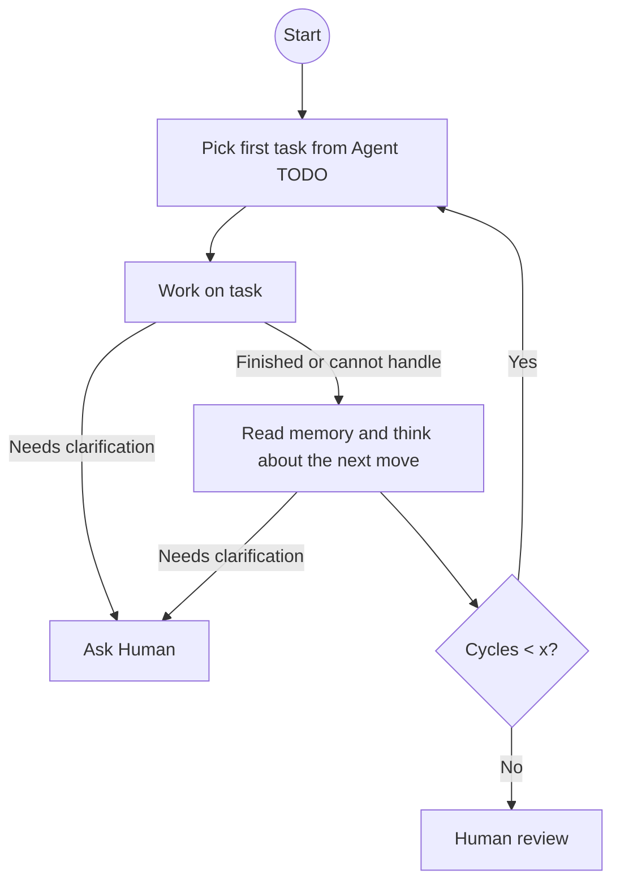

# Idea Execution Framework

## Vision
Make executing ideas with an AI efficient and transparent, with plans, decisions, artifacts, and learnings versioned and human‑auditable. The Lead Agent collaborates with the human to clarify the idea and drive execution in observable steps. Human involvement is minimized by phase: high during early idea elaboration, lower during planning/prototyping, and as low as possible during execution within agreed scope. Specialized agents may be involved when helpful, but are not required for small projects.

## Core Principles
- Git repo as shared project state/blackboard.
- Persist all plans, decisions, artifacts, and learnings in the repo.
- Human provides the vision and makes high-level decisions; the Lead Agent (level-1) collaborates and may delegate when beneficial.
- Memory is in repo: both working artifacts and distilled interaction learnings live as files here.
- Repo is the single source of truth and synchronization medium; plans and specs live here and drive delegation.

### Operating Model

## Roles
- Human: sets idea, constraints, core principles, requirements, approves major decisions, provides clarifications
- Lead Agent (L1): a critical partner who helps think through and clarify the idea, expands high-level ideas into actionable detail, turns ideas into plans, executes tasks, and keeps the repo in sync; may involve specialized agents if needed.
- Specialized Agents (L2+, optional): coding, ops, research, etc.

## Iteration rhythm
- Updates to the repo happen whenever useful (often after meaningful exchanges) and at least once per focused work cycle to keep the repo the single source of truth.
- Phases are flexible and can overlap:
	- Phase A – Idea Elaboration (high human involvement): Human states goal/idea; L1 probes, challenges, and expands; fast back-and-forth in README; capture assumptions and decisions.
    - Phase B – Planning & Prototyping (moderate human involvement): L1 drafts approaches, proposes tasks, executes small spikes; human reviews key choices.
    - Phase C – Execution (low human involvement): L1 works autonomously within agreed scope; updates repo regularly; escalates only for major decisions or boundary changes.

### L1 Agent work loop

1) Work on the first task from the Agent TODO list until either:
	 - the task is finished, or
	 - the agent encounters a problem it cannot handle.
	 In both cases, update memory (Interaction Log, Learnings, and Decisions if applicable).
2) Read memory and think about the next move - update memory including TODO
3) Repeat steps 1–2 up to x cycles, then return status to human.

At any point, the agent may decide that further work requires a clarifying question to the human.

## Repository Structure & Memory
Start README-first. Add additional files and folders only when the project grows; keep the repo the single source of truth.

- README.md
	- vision
	- core principles
	- operating model
	- repository structure & memory
	- iteration rhythm
	- TODOs (Lead Agent, Human)
	- roadmap
	- decision notes (template)
	- learnings (template)

Memory approach: we keep Decisions, Learnings, and an Interaction Log inline here first to maximize transparency and minimize overhead. When those sections grow, we’ll split them into `DECISIONS.md`, `LEARNINGS.md`, and `LOG.md`. Retrieval isn’t needed right now—we rely on long‑context models over the repo files (or the whole repo when practical). Summarization may help with periodic roll‑ups later, but it’s intentionally deferred for now.

## Interaction Log
- 2025-09-30 – Designed the high-level L1 Agent work loop and added a Mermaid diagram under “Iteration rhythm”. Outcome: keep the loop intentionally high-level, rely on LLM judgment for “cannot handle,” and cap cycles to x (default 5); README updated accordingly.
- 2025-09-30 – Research on agent frameworks and memory approaches. Outcome: adopted the simple memory policy above; detailed comparison captured in the [related-frameworks.md](related-frameworks.md).

## TODO – Lead Agent
- ???

## TODO – Human
- Define/refine the vision iteratively, perform researches with the Lead Agent (using Copilot as L1 for now).
- Research with AI https://github.com/ruvnet/claude-flow
    - Clarify the difference between the "neural module" and "Memory system" in Claude Flow.
- Review how multi-agent features work in Codex/Claude CLI; identify patterns to reuse.
- Check research chat: "Badania nad AI i pamięcią".
- Think what should be the structure of the projects that will be used to execute ideas according to the Idea Execution Framework

## Roadmap
- Phase 1: Execute Phase A for "Idea Execution Framework" (this repo is the pilot) till Phase B or till Phase 2 below.
- Phase 2: When the framework feels solid, start a second project executed according to it.